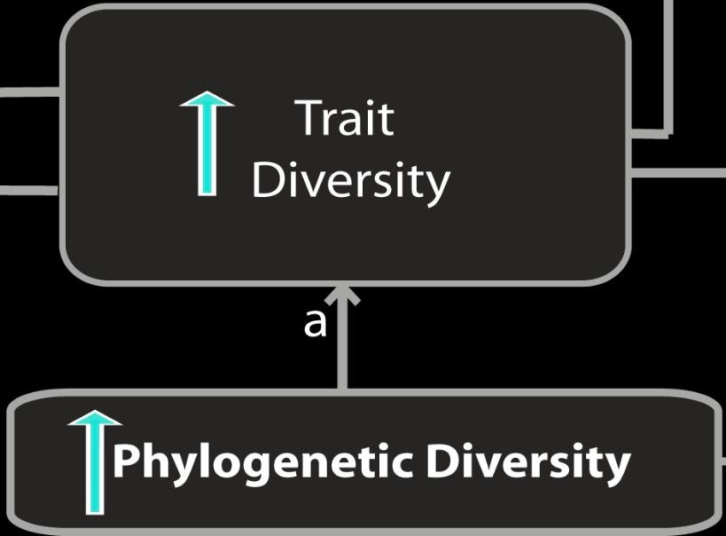
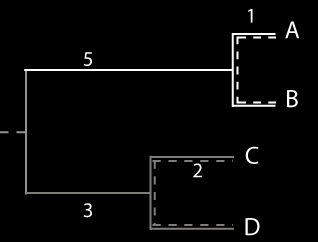
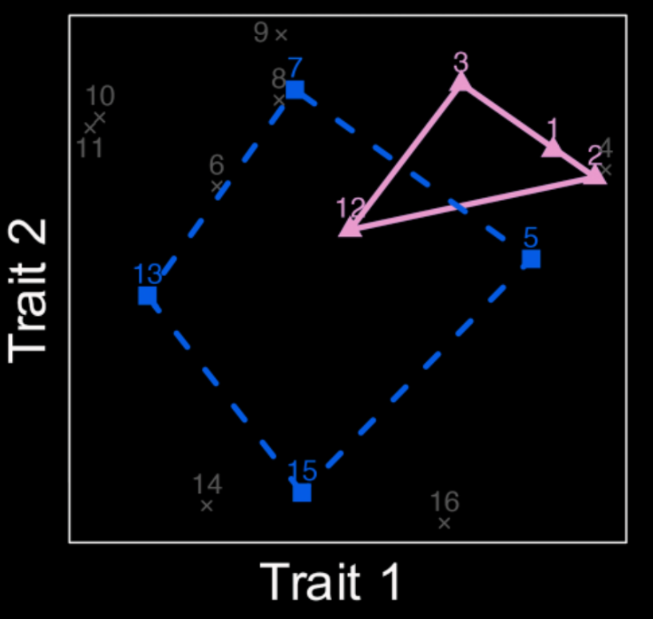
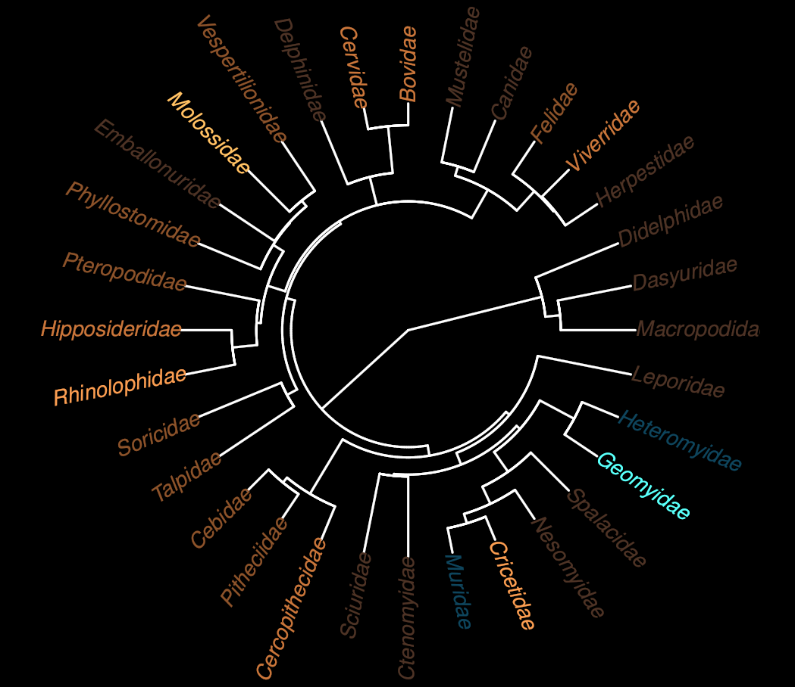
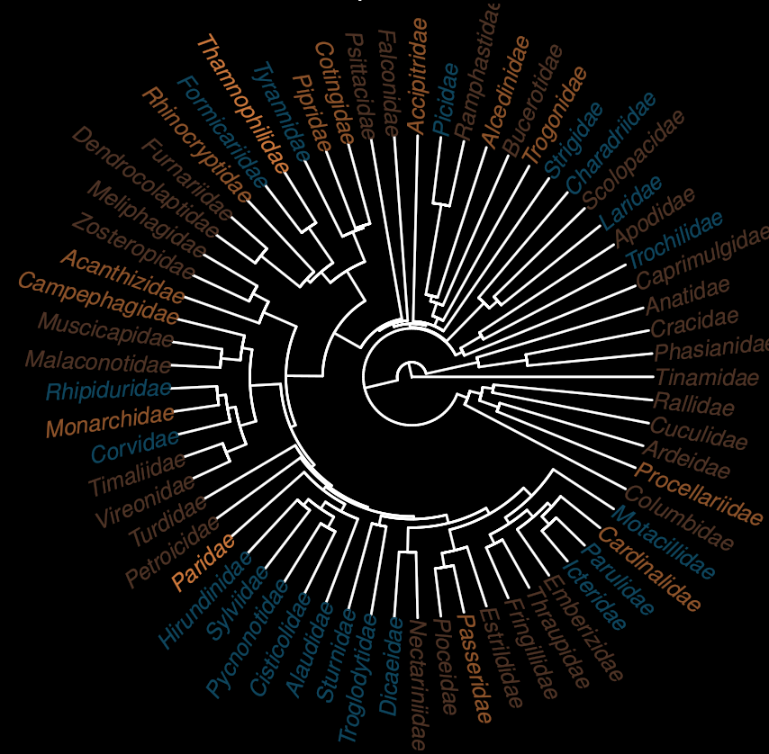
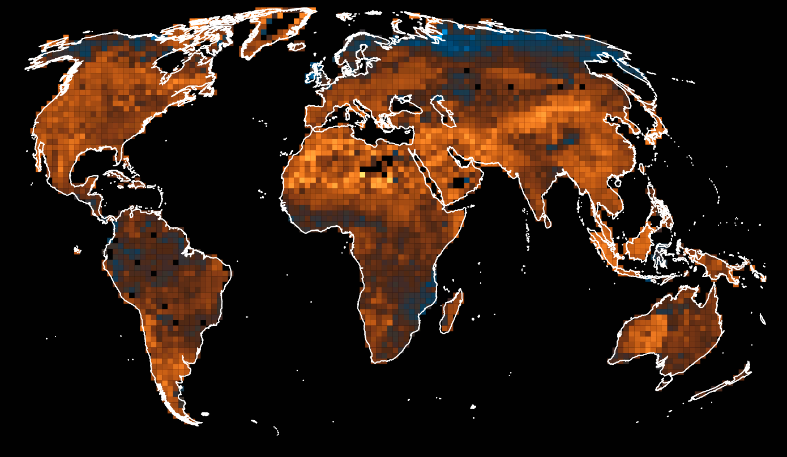
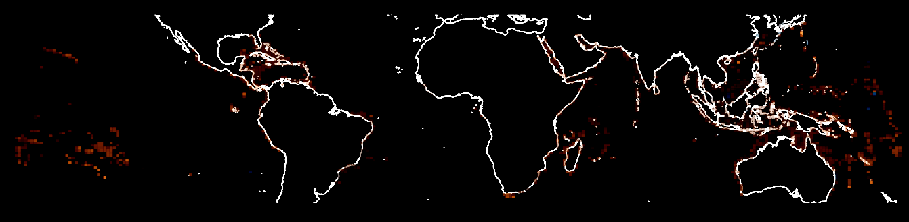
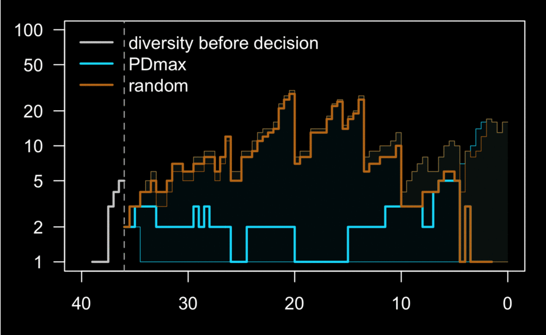
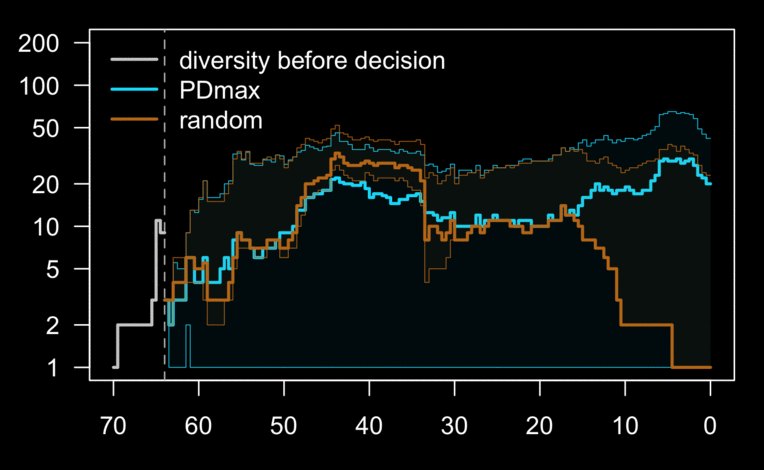
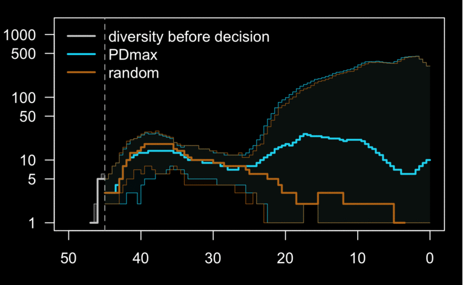

class: right, middle, inverse

```{r setup, include=FALSE}
options(htmltools.dir.version = FALSE)
```

# Biodiversity!

???

We think we have a pretty good understanding of what biological diversity is. And we have in mind something like this:

---
class: inverse
background-image: url(http://www.henrirousseau.net/images/famous/the-dream.jpg)
background-size: contain

???

Image credit: Henry Rousseau, The Dream (1910)

Sure, we may be missing a lot in that picture, little stuff like bacteria or more boring stuff like species that do not strike the eye. But, that's what we think.

---
class: left, middle, inverse

# Biodiversity?

--

## Measuring means caring.

???

The problem is, that painting is not easy to explain without running in circles. Why do we like biodiversity? 'Cause we like variety.

Moreover, that painting does not suggest an easy way of measuring biodiversity. Is it the number of species? Their morphological diversity? The presence of astounding unique traits? The intricacy of their ecological relationship? Their value to us as human beings? Their unique (and partly shared) histories? Or even something else?

---
class: center, inverse, bottom

> ### What's So Good About Biodiversity?

--

> could not find a single argument that does not have serious logical flaws, crippling qualifications, or indefensible assumptions<sup>[1]</sup>
>
> Donald S. Maier

--

### Then, let's get to work!

???

Philosophers and biologist have been asking it. An informative review and discussion of various ideas is offered by Donald S. Maier.

Maier Concludes that it's all blah blah. All the common definition, lacking a clear and solid fundament in data and science, are fragile, void.

Yet, lack of evidence is not evidence of lack.

---
class: left, middle, inverse

## What is biodiversity?

--

### Evolution 
--
+ Ecology 
--
+ us

---
class: right, bottom, inverse
background-image: url(./Images/tr_hall_ext.png)
background-size: contain

.pull-right[sDiv Leipzig (DE) group on biodiversity, with Caroline Tucker (UNC, USA), Richard Grenyer (Oxford), Marten Winter  (iDiv Leipzige, DE), ...]

---
class: left, middle, inverse
background-image: url(./Images/tr_hall.png)
background-size: contain

---
class: left, middle, inverse
background-image: url(./Images/tr_augmented-i.png)
background-size: contain

---
class: left, middle, inverse
background-image: url(./Images/tr_augmented_blank.png)
background-size: contain

---
class: center, bottom, inverse


.footnote[Florent Mazel, Matt Pennell (UBC), Arne Mooers (SFU).]

---
class: center, inverse

### What is Phylogenetic Diversity?

--



--

$PD(\{A,B, C, D\}) = 5+1+1+3+2+2=14$

--

$PD(\{A,B\}) = 5 + 1 + 1 = 7$

$PD(\{A,C\}) = ... = PD(\{B,D\}) = 5 + 1 + 3 + 2 = 11$

---
class: center, inverse

### What is Trait Diversity?

--



--

.footnote[ _Richness_, _Dispersion_;  
_Functional_, ...,]

---
class: center, middle, inverse

### High PD => High TD

--

Or, at least, not so little.

--

> _unique beasts are strange indeed_

---
class: middle, center, inverse

**_Biological_ notion**

--

Set of taxa that maximise Phylogenetic Diversity will have more diverse traits than random.


---
class: center, middle, inverse


### Step 1: Translate.

We need three things 
--
plus one:

--

0. A way of measuring Phylogenetic Diversity.

--

1. A way of measuring Trait Diversity.

--

2. A model for growing traits on trees.

--

3. Two different sampling techniques.

---
class: center, middle, inverse

### 1.2.   Measuring TD

--

Traits are points in a $N$ dimensional metric space.

--

A set of species define a convex hull. If it is not degenere we can measure its volume.

--

.footnote[Computing hulls is easy.  
Measuring volumes is heavy.  
We also considered alternative definitions.]

---
class: center, middle, inverse

### 1.2. Measuring TD

#### Is that a little or a lot?

--

Getting the max.  

--

That's tougher. 
--
More about it later (maybe).

---
class: center, middle, inverse

### 1.3. Growing Traits on Trees

--

***How does evolution work?***

--

Randomly 
--
(mostly).

--

***What looks like a random process?***

--

Brownian motion
--
<sup>[1]</sup>

.footnote[Growing traits as BM goes back to the '50s with _Cavalli Sforza_ & _Edwards_. Got grip thanks to _Felsenstein_ in the '80s. A lot of inertia there.]

---
class: center, inverse

### 1.3. Growing Traits on Trees

#### simple Brownian Motion

$$X_i(t + \delta t) - X_i(t) \sim \delta t \ \mathcal{N}(0,\sigma)$$

--

$\sigma$ is the _speed_ of the evolutionary process.

--

.footnote[Correlation between traits on a lineage is possible.]

---
class: center, inverse

### 1.3. Growing Traits on Trees

#### Branching Brownian Motion

$$X_i(t + \delta t) - X_i(t) \sim \delta t \ \mathcal{N}(0,\sigma(t))$$

--

At the time $s$ of a branching

$$X_l(s) = X_r(s) = X_m(s) \\ \sigma_l(s) = \sigma_r(s) = \sigma_m(s)$$

--

with

$$\sigma_i(t) = \sigma(t,i)$$
e.g., $\sigma(t,i) = \sigma(t,a(i))$ where $a(i)$ is the time since birth of the lineage $i$.

--

.footnote[Correlation between traits on a lineage is possible. Lineages do not see each other.]

---
class: center, inverse

### 1.4. Picking kiwis from the tree

---
class: center, inverse

### 1.4. Picking ~~kiwis~~ leaves from the tree

Given a tree with $M$ leaves, and a target of $N$ leaves

--

1.  _Random_: Select any set of $N$ leaves with uniform probability.

--

2.  _Max PD_: Select any set of $N$ leaves with uniform probability from the family of $N$-leaf sets maximising Phylogenetic Diversity.

--

3.  _Max TD_: Select any set of $N$ species with uniform probability from the family of $N$-species sets maximising Convex Hull Volume.
--
<sup>[1]</sup>

.footnote[
[1] It really doesn't matter, as long as we can get the max volume.
]

---
class: center, inverse

### 1.4. Picking ~~kiwis~~ leaves from the tree

Given a tree with $M$ leaves, and a target of $N$ leaves

.footnote[[1] It's $O(M\log{N})$.]

2. _Max PD_ <- Getting **a** set with Max PD is easy<sup>[1]</sup> 
--
(we go greedy, thanks Mike) 
--
, to get **many** sets with Max PD is not harder, 
--
getting them **all**...

---
class: inverse, middle, center

### Step 2: Prove (or not).

**_Biological_ notion:** Set of taxa that maximise Phylogenetic Diversity will have more diverse traits than random.  

--

**Theorem:**
*  Let $\{\tau_i,X_{j}(\tau_i)\}$ be a family of random trees<sup>[1]</sup> $\tau_i$ and traits $X_{j}$ grown on those trees according to a BBM process with evolutionary speed $\sigma$.
*  Let $S_P$ be a set of leaves $\tau_i$ sampled from a tree according to a stratedy $P$.
*  Let $TD(S_P)$ be the volume of the convex hull enclosing the traits of the leaves in $S_P$.

=> Then the expected value<sup>[2]</sup> of $TD(S_{maxPD})$ is greater or equal to the expected value of $TD(S_{Random})$.

.footnote[
[1] Binary, ultrametric, costant rate birth-death trees.  
[2] The expectation is considered over the trees, the traits and the sampling.]

---
class: inverse, middle, center

### Step 2: Prove (or not).

If the BBM histories share a common regime

--

$\sigma(t,i) = \sigma(t,j) \qquad \forall t, i, j$:

--


--

Higher PD => Higher variance => Higher TD.

--

And holds for a weaker request on $\sigma$s, i.e., all sampled from same distribution.

---
class: inverse, bottom, center

### Step 2: Prove (or not).

We verified it. 

.

--

.

Nothing to see here, please go home.

.

--

.

And that's where the story usually ends.  

.

--

.

But...


---
class: inverse, center

### Step 2: Prove (or not).
#### What if

we consider a slightly more general BBM model:

--

$\sigma(i,t) = l(i)^{\chi}$?  

where $l(i)$ is the length of branch $i$?

--

e.g., what if lineages that split frequently have a higher evolutionary speed?

--

.footnote[_Ecological radiations_]

--

Then, it depends.

---
class: inverse
background-image: url(Images/PD_redblue-i.png)
background-size: contain

--

It depends on $\chi$  
--
and the shape of the tree.  

--

.footnote[It's the same for Rao's entropy, ...]

---
class: inverse
background-image: url(Images/PD_redblue-i.png)
background-size: contain


It depends on $\chi$ and the shape of the tree.  

.footnote[And it does NOT depend on (lack of) phylogenetic signal.]

---
class: center, inverse

### Step 3: Assess

--

#### how does evolution _really_ work?   

.footnote[..., Sandra Diaz (Universidad Nacional de Córdoba, Argentin), David Mouillot (Australian Research Council Centre of Excellence for Coral Reef Studies), William Pearse (Utah State University), ...]
---
class: center, inverse

#### Step 3: how does evolution _really_ work?  
It depends.  
--



Mammal clades

---
class: center, inverse

#### Step 3: how does evolution _really_ work?  
It depends.  
--



Bird clades

---
class: center, middle, inverse

#### Step 3: how does evolution _really_ work?  

It depends.                  


Mammals

---
class: center, middle, inverse

#### Step 3: how does evolution _really_ work?  

It depends.                  


Birds

---
class: center, middle, inverse

#### Step 3: how does evolution _really_ work?  

It depends.                  


Fish

---
class: center, middle, inverse

It is still very hard to put that data together.

---
class: inverse

### Bottom line:

#### We take one of those arrows
--
, (1) translate it into a rigorous prediction
--
, (2) explore the parameters that make it true or false
--
, and (3) assess its empirical support.

---
class: center, middle, inverse

## You promised the dinosaurs!

--

Arrow "h" here:

---
class: left, middle, inverse
background-image: url(./Images/tr_augmented-i.png)
background-size: contain


---
class: inverse, middle

**_Biological_ notion:** (Phylogenetic) diversity begets diversity
--
, higher evolutionary potential / lower clade extinction risk.

---
class: left, middle, inverse
background-image: url(./Images/dinosaurs-i.png)
background-size: contain

---
class: left, middle, inverse
background-image: url(./Images/dinosaurs-i-p.png)
background-size: contain

---
class: left, middle, inverse
background-image: url(./Images/dinosaurs-i-p-f.png)
background-size: contain

---
class: left, middle, inverse
background-image: url(./Images/dinosaurs-i-p-ff.png)
background-size: contain

---
class: inverse

### Step 3: Assess.

--

#### 3.1 Gather the data.

--

Highly defined dated phylogenies for:
*   Canids
*   Foramineferas
*   Ruminants
*   Horses
*   Dinosaurs

--

It took *a lot* of paleontologists to put those together.

.footnote[Juan Cantalapiedra (Museum für Naturkunde - Berlin), Tracy Aze (University of Leeds, UK), Marc W Cadotte (University of Toronto), Danwei Huang (National University of Singapore), Chelsea Chisholm (University of Copenhagen), ...]
---
class: inverse

### Step 3: Assess.


#### 3.2 Ask the dogs




---
class: inverse

### Step 3: Assess.


#### 3.2 Ask the forams




---
class: inverse

### Step 3: Assess.


#### 3.2 Ask the ruminants




---
class: inverse

### Step 3: Assess.


#### 3.2 Ask the horses


---
class: inverse

### Step 3: Assess.


#### 3.2 Ask the dogs, forams, ruminants, or horses:

--

#### they all say **no**.

---
class: inverse

### Step 3: Assess.


#### 3.2 Ask the dinos


---
class: inverse

### Step 2: Prove (or not).


#### 3.2 Ask the dinos: why is that?

--

We don't know (yet).

---
class: left, middle, inverse
background-image: url(./Images/LTT-area-i.png)
background-size: contain

---
class: inverse

### Step 2: Prove (or not).


#### 3.2 Ask the dinos: why is that?

--

We need more data and more theory.  
--
It's coming.

--

..

---
class: inverse, middle, center

## We could have saved the dinosaurs!